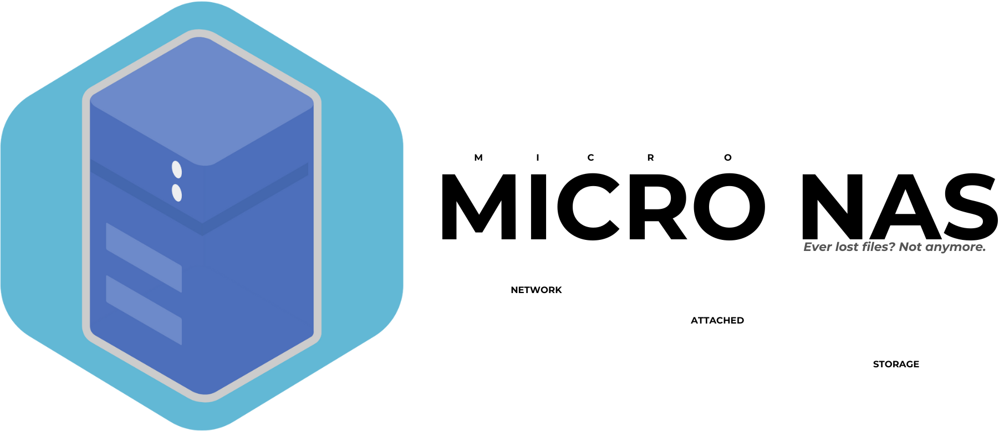

# MICRO NAS - Monitor

This is a web page for users to view, access, and configure their very own MICRO NAS through a user-friendly interface.


## Acknowledgements

 - [Orange Pi Zero 3](http://www.orangepi.org/html/hardWare/computerAndMicrocontrollers/details/Orange-Pi-Zero-3.html) - The SBC (Single Board Computer) used as the base for the MICRO NAS.
 - [Armbian OS](https://github.com/leeboby/armbian-images) - The OS (Operating System) used to operate the MICRO NAS, specifically, the server/headless installation.
 - [ZeroTier](https://www.zerotier.com/) - The VN (Virtual Network) used to connect the MICRO NAS over the Wide Area Network for convenient access.

## Authors

- [@NefydHP](https://github.com/NefydHP) - Repository author and Webpage developer 
- [@SqueekCheese](https://github.com/SqueekCheese) - Modular Information Card-based Resource Organizer (MICRO) NAS inventor.
## Deployment

To deploy this project run

```bash
  npm run deploy
```
or
```bash
  node server.js
``````
## Installation & Usage
### Prerequisites
Ensure you have Node.js installed. If you don't have it, download and install it from:

🔗 https://nodejs.org/
(Node.js comes with npm and npx by default.)

### Installation Options
**Run Without Installation (Recommended for One-Time Use)**

You can run the tool directly using npx (no installation needed):

```bash
npx orange-pi-monitor
```

**Install Locally (Recommended for Projects)**

If you want to use the tool in a project, install it locally:

```bash
npm install orange-pi-monitor
```

Then run it with:

```bash
npx orange-pi-monitor
```

**Install Globally (Recommended for System-Wide Use)**

To install it globally on your system:

```bash
npm install -g orange-pi-monitor
```

Now you can run it from anywhere:

```bash
orange-pi-monitor
```

## Uninstallation
If you no longer need it, remove it with:

**For global installation:**

```bash
npm uninstall -g orange-pi-monitor
```

**For local installation:**

```bash
npm uninstall orange-pi-monitor
```
## Features

- Dashboard for introduction, resources, links, and socials.
- Disks Page for viewing and modifying files inside your MICRO NAS.
- Settings Page for configuring website theme (light/dark), among other things.
- Login Page for initializing the MICRO NAS' IP address, the username you wish to use, and the user password.
## Feedback

If you have any feedback, please reach out to us at group2.iii.gnhs@gmail.com

